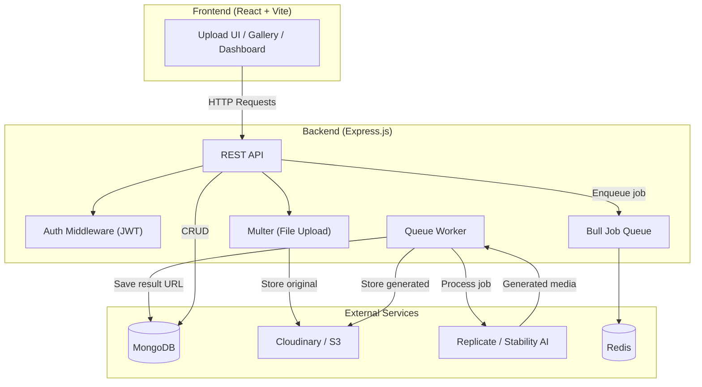

# higgsfeild
Full-stack AI photo &amp; video generation platform — upload a selfie, get AI-stylized photos and short videos. Built with Express.js, MongoDB, React, and Replicate AI.
# Higgsfield — AI Photo & Video Generation Platform

## Product Requirements Document (PRD)

### 🎯 Vision
Build a full-stack application (clone-inspired by **Higgsfield AI**) where users upload a selfie/photo and the platform generates AI-stylized photos and short AI videos from it. This project doubles as a **backend revision** and **frontend learning** journey.

---

## Core Features

| # | Feature | Description | Priority |
|---|---------|-------------|----------|
| 1 | **User Auth** | Sign up / Login with email+password (JWT-based) | P0 |
| 2 | **Photo Upload** | Upload a photo (selfie) via REST API | P0 |
| 3 | **AI Photo Generation** | Send the uploaded photo to an AI model and return stylized/generated photos | P0 |
| 4 | **AI Video Generation** | Generate a short AI video from the photo | P1 |
| 5 | **Gallery** | View all generated photos/videos per user | P0 |
| 6 | **Download & Share** | Download generated media or get a shareable link | P1 |
| 7 | **Generation History** | Track all past generations with status (pending/done/failed) | P1 |
| 8 | **Rate Limiting** | Limit API usage per user (free tier / paid tier) | P2 |
| 9 | **Frontend Dashboard** | Web UI to upload, view, and manage generations | P1 |

---

## Tech Stack

### Backend (Your Revision Focus 🔄)
| Layer | Technology | Why |
|-------|-----------|-----|
| **Runtime** | Node.js (ES Modules) | Already set up in your project |
| **Framework** | Express.js | Industry standard, great for learning REST patterns |
| **Database** | MongoDB + Mongoose | Flexible schema for media metadata, good to learn NoSQL |
| **Auth** | JWT (jsonwebtoken + bcrypt) | Stateless auth — core backend concept |
| **File Storage** | Cloudinary or AWS S3 | Store uploaded & generated photos/videos |
| **Job Queue** | Bull (Redis-backed) | AI generation is async; queues handle long-running jobs |
| **AI APIs** | Replicate API or Stability AI | Actual AI image/video generation (pay-per-use, cheap for dev) |
| **Validation** | Joi or Zod | Request validation — critical backend skill |

### Frontend (Your Learning Focus 📚)
| Layer | Technology | Why |
|-------|-----------|-----|
| **Framework** | React (Vite) | Modern, widely used, great ecosystem |
| **Styling** | Vanilla CSS (or Tailwind later) | Learn fundamentals first |
| **HTTP Client** | Axios or Fetch API | Communicate with your backend |
| **State** | React Context + useReducer | Before jumping to Redux |
| **Routing** | React Router v6 | Client-side navigation |

---

## Architecture Overview



---

## Backend Folder Structure (Planned)

```
higgsfield/
├── index.js                  # Entry point — Express app setup
├── package.json
├── .env                      # Environment variables (never commit!)
├── config/
│   └── index.js              # Centralized config (reads from .env)
├── database/
│   └── db.js                 # MongoDB connection via Mongoose
├── models/
│   ├── User.js               # User schema
│   └── Generation.js         # Generation job schema (photo/video)
├── routes/
│   ├── auth.routes.js        # POST /register, POST /login
│   ├── upload.routes.js      # POST /upload
│   └── generation.routes.js  # POST /generate, GET /generations
├── controllers/
│   ├── auth.controller.js
│   ├── upload.controller.js
│   └── generation.controller.js
├── middleware/
│   ├── auth.middleware.js     # JWT verification
│   ├── upload.middleware.js   # Multer config
│   └── error.middleware.js    # Global error handler
├── services/
│   ├── ai.service.js          # Replicate/Stability AI integration
│   ├── storage.service.js     # Cloudinary/S3 upload logic
│   └── queue.service.js       # Bull queue setup + workers
├── utils/
│   └── helpers.js             # Utility functions
└── validators/
    ├── auth.validator.js      # Joi/Zod schemas for auth
    └── generation.validator.js
```

---

## API Endpoints (v1)

### Auth
| Method | Endpoint | Description | Auth? |
|--------|----------|-------------|-------|
| `POST` | `/api/v1/auth/register` | Create account | No |
| `POST` | `/api/v1/auth/login` | Get JWT token | No |
| `GET` | `/api/v1/auth/me` | Get current user | Yes |

### Upload & Generation
| Method | Endpoint | Description | Auth? |
|--------|----------|-------------|-------|
| `POST` | `/api/v1/upload` | Upload a photo | Yes |
| `POST` | `/api/v1/generate` | Start AI generation (photo or video) | Yes |
| `GET` | `/api/v1/generations` | List all user generations | Yes |
| `GET` | `/api/v1/generations/:id` | Get specific generation status + result | Yes |
| `DELETE` | `/api/v1/generations/:id` | Delete a generation | Yes |

---

## Development Phases

### Phase 1 — Backend Foundation (Week 1-2) 🔧
> **Learning focus:** Express basics, middleware, routing, MongoDB, Mongoose

- [ ] Set up Express server with proper middleware (cors, helmet, morgan)
- [ ] Connect to MongoDB using Mongoose
- [ ] Create User model + auth routes (register/login with JWT)
- [ ] Add auth middleware for protected routes
- [ ] Add request validation with Joi/Zod

> **📖 Docs to read:**
> - [Express.js Guide](https://expressjs.com/en/guide/routing.html)
> - [Mongoose Getting Started](https://mongoosejs.com/docs/index.html)
> - [JWT Introduction](https://jwt.io/introduction)

---

### Phase 2 — File Upload & Storage (Week 2-3) 📁
> **Learning focus:** Multer, file handling, cloud storage

- [ ] Set up Multer for file uploads (memory/disk storage)
- [ ] Integrate Cloudinary (or S3) for persistent storage
- [ ] Create upload endpoint that stores file and returns URL
- [ ] Add file type/size validation

> **📖 Docs to read:**
> - [Multer docs](https://github.com/expressjs/multer)
> - [Cloudinary Node.js SDK](https://cloudinary.com/documentation/node_integration)

---

### Phase 3 — AI Integration & Job Queue (Week 3-4) 🤖
> **Learning focus:** Async processing, job queues, third-party API integration

- [ ] Set up Redis + Bull queue
- [ ] Create generation endpoint that enqueues jobs
- [ ] Build queue worker that calls Replicate API (or Stability AI)
- [ ] Handle job status updates (pending → processing → done/failed)
- [ ] Store generated media URLs back in MongoDB

> **📖 Docs to read:**
> - [Bull Queue docs](https://docs.bullmq.io/)
> - [Replicate API docs](https://replicate.com/docs)
> - [Stability AI API](https://platform.stability.ai/docs/api-reference)

---

### Phase 4 — Frontend (Week 4-6) 🎨
> **Learning focus:** React fundamentals, component design, API integration

- [ ] Set up Vite + React project
- [ ] Build auth pages (Login / Register)
- [ ] Build upload page with drag-and-drop
- [ ] Build gallery page showing generations
- [ ] Add loading states, error handling, and polish

> **📖 Docs to read:**
> - [React docs (new)](https://react.dev/learn)
> - [Vite Getting Started](https://vite.dev/guide/)
> - [React Router v6](https://reactrouter.com/en/main/start/tutorial)

---

### Phase 5 — Polish & Deploy (Week 6-7) 🚀
- [ ] Add rate limiting (express-rate-limit)
- [ ] Add proper error handling everywhere
- [ ] Write API documentation (Swagger/OpenAPI)
- [ ] Deploy backend (Render / Railway / fly.io)
- [ ] Deploy frontend (Vercel / Netlify)
- [ ] Set up CI/CD (GitHub Actions)

---

## Open Questions

> [!IMPORTANT]
> **AI Provider Choice:** Replicate has a broader model library and is easier to get started with. Stability AI has dedicated image/video models. Which would you prefer, or should we start with Replicate for flexibility?

> [!IMPORTANT]
> **Storage Choice:** Cloudinary has a generous free tier and built-in image transformations. S3 gives more control but more setup. Preference?

> [!IMPORTANT]
> **Database:** The plan assumes MongoDB. Are you comfortable with that, or would you prefer PostgreSQL (which would use Prisma/Sequelize instead of Mongoose)?

> [!IMPORTANT]
> **Scope Check:** Do you want to include user profile features (avatar, bio, settings) or keep it minimal with just auth + generations?

> [!IMPORTANT]
> **Video Generation:** Generating AI videos is more expensive and complex. Should we tackle it in Phase 3 alongside photos, or push it to a later phase?
